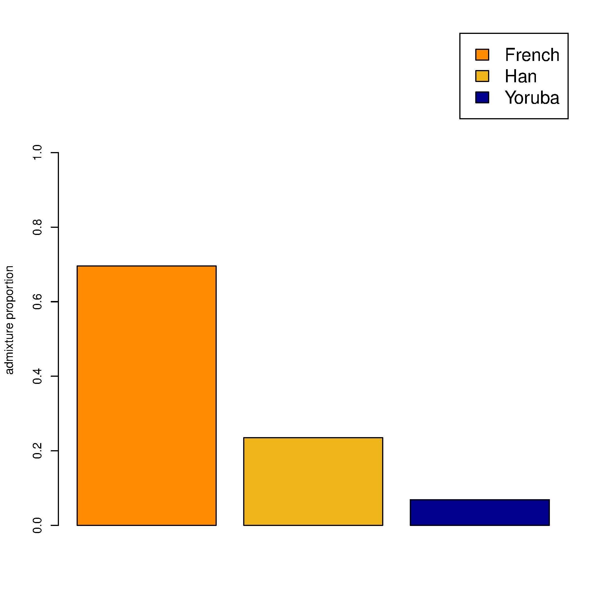
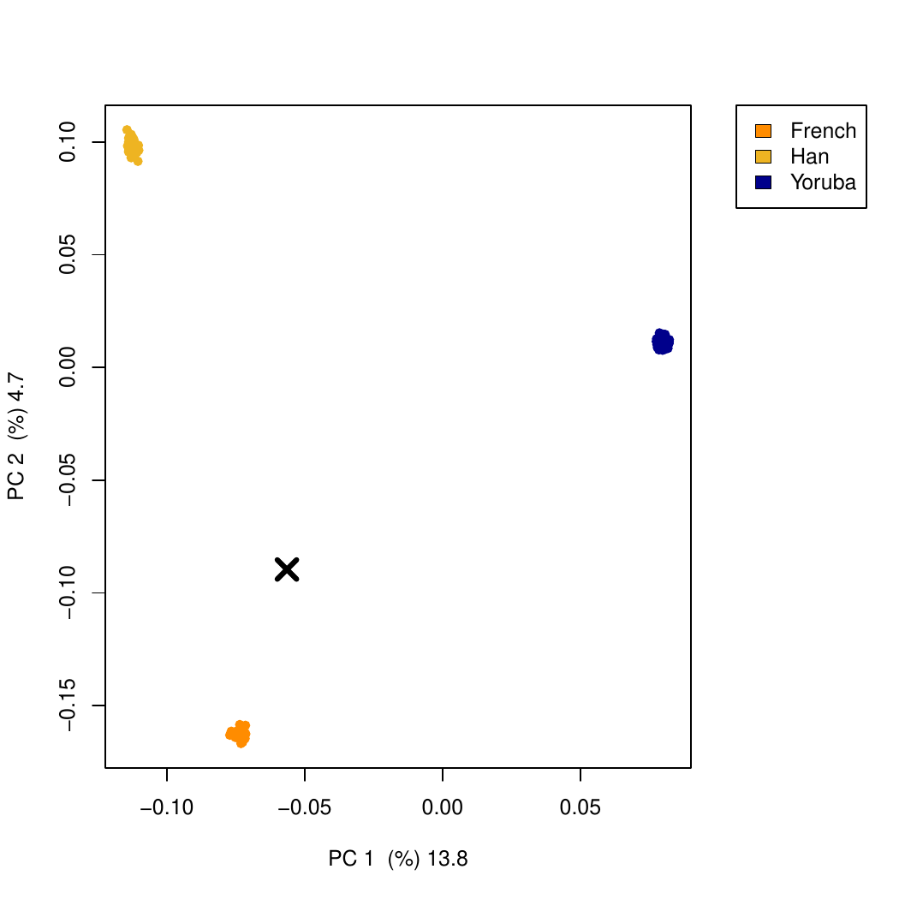
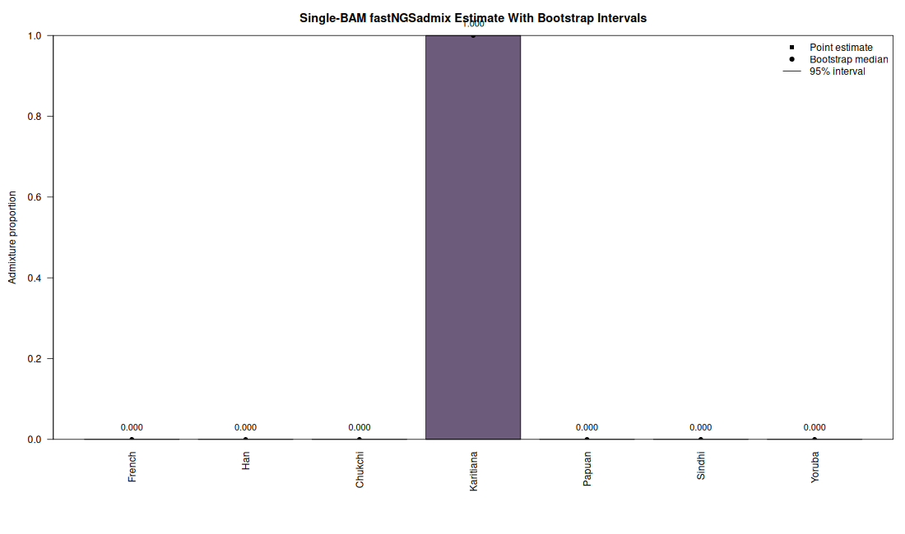
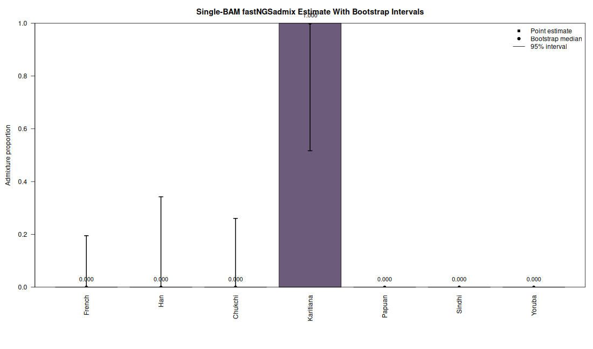

# fastNGSadmix Example Data Tutorial

This tutorial uses the example archives linked from the fastNGSadmix project
page:

- `https://www.popgen.dk/software/index.php/FastNGSadmix`
- `https://www.popgen.dk/software/download/fastNGSadmix/data.tar.gz`
- `https://www.popgen.dk/software/download/fastNGSadmix/example.tar.gz`

The steps below build the program, download the hosted example data, estimate
admixture proportions from both genotype likelihoods and a single-individual
PLINK file, run PCA for each case, and then run a bootstrap example for two
low-information beagle samples.

## 1. Build fastNGSadmix

From the repository root:

```bash
make
```

<details>
<summary>Example output</summary>

```text
g++ src/fastNGSadmix.cpp src/readplinkV3.cpp -O3 -lz -o fastNGSadmix
```

</details>

If you want to run the PCA examples, install the R package used by the scripts:

```r
install.packages("BEDMatrix")
```

<details>
<summary>Example output</summary>

```text
Installing package into "/path/to/R/library"
...
* DONE (BEDMatrix)
```

</details>

## 2. Download the example archives into `data/`

Run these commands from the repository root:

```bash
mkdir -p data
wget -P data https://www.popgen.dk/software/download/fastNGSadmix/data.tar.gz
wget -P data https://www.popgen.dk/software/download/fastNGSadmix/example.tar.gz
tar -xzf data/data.tar.gz
tar -xzf data/example.tar.gz
```

<details>
<summary>Example output</summary>

```text
data/data.tar.gz
data/example.tar.gz
data/refPanel_humanOrigins_7worldPops.txt
data/nInd_humanOrigins_7worldPops.txt
example/yriFrenchHan_depth05.beagle.gz
example/NA20502_TSI.bed
example/NA20502_TSI.bim
example/NA20502_TSI.fam
```

</details>

The downloaded archives are stored in `data/`, while unpacking from the
repository root creates the working directories `data/` and `example/`.

## 3. Run the genotype-likelihood example

Set the input and reference paths:

```bash
mkdir -p results
GL=example/yriFrenchHan_depth05.beagle.gz
REF=data/refPanel_humanOrigins_7worldPops.txt
NIND=data/nInd_humanOrigins_7worldPops.txt
```

<details>
<summary>Example output</summary>

```text
(no terminal output)
```

</details>

Estimate admixture proportions:

```bash
./fastNGSadmix -likes "$GL" -fname "$REF" -Nname "$NIND" -out results/yriFrenchHan_depth05 -whichPops French,Han,Yoruba
```

<details>
<summary>Example output</summary>

```text
-> Dumping file: results/yriFrenchHan_depth05.log
Input: -likes example/yriFrenchHan_depth05.beagle.gz -plink (null) -Nname data/nInd_humanOrigins_7worldPops.txt -fname data/refPanel_humanOrigins_7worldPops.txt -out results/yriFrenchHan_depth05 -whichPops French,Han,Yoruba
Overlap: of 95913 sites between input and ref
Chosen pop French
Chosen pop Han
Chosen pop Yoruba
Estimated  Q = 0.695856 0.235121 0.069023 best like -97538.374384 after 0 runs!
-> Dumping file: results/yriFrenchHan_depth05.qopt
```

</details>

This writes:

- `results/yriFrenchHan_depth05.qopt`
- `results/yriFrenchHan_depth05.log`

Run PCA using the estimated admixture proportions:

```bash
Rscript R/fastNGSadmixPCA.R -likes "$GL" -qopt results/yriFrenchHan_depth05.qopt -out results/yriFrenchHan_depth05 -ref data/humanOrigins_7worldPops
```

<details>
<summary>Example output</summary>

```text
Reference populations used: French, Han, Yoruba
Calculating covarinace matrix for reference individuals
Calculating covarinace matrix for input individual
Input individual ('SAMPLE') is plotted at in PCA plot:
-0.0564757832664593 -0.0896450779920364
Output files:
 - results/yriFrenchHan_depth05_covar.txt
 - results/yriFrenchHan_depth05_indi.txt
 - results/yriFrenchHan_depth05_eigenvecs.txt
 - results/yriFrenchHan_depth05_eigenvals.txt
 - results/yriFrenchHan_depth05_admixBarplot.png
 - results/yriFrenchHan_depth05_PCAplot.pdf
```

</details>

Generated example outputs from the BEDMatrix-backed test run in this repo:

- Admixture barplot: [tutorial_figures/yriFrenchHan_depth05_bedmatrix_admixBarplot.png](tutorial_figures/yriFrenchHan_depth05_bedmatrix_admixBarplot.png)
- PCA plot PDF: [tutorial_figures/yriFrenchHan_depth05_bedmatrix_PCAplot.pdf](tutorial_figures/yriFrenchHan_depth05_bedmatrix_PCAplot.pdf)
- PCA plot PNG: [tutorial_figures/yriFrenchHan_depth05_bedmatrix_PCAplot.png](tutorial_figures/yriFrenchHan_depth05_bedmatrix_PCAplot.png)
- Covariance matrix: [results/yriFrenchHan_depth05_bedmatrix_covar.txt](results/yriFrenchHan_depth05_bedmatrix_covar.txt)
- Eigenvectors: [results/yriFrenchHan_depth05_bedmatrix_eigenvecs.txt](results/yriFrenchHan_depth05_bedmatrix_eigenvecs.txt)





## 4. Run the PLINK example

Set the PLINK input prefix:

```bash
PLINKFILE=example/NA20502_TSI
```

<details>
<summary>Example output</summary>

```text
(no terminal output)
```

</details>

Estimate admixture proportions:

```bash
./fastNGSadmix -plink "$PLINKFILE" -fname "$REF" -Nname "$NIND" -out results/NA20502_TSI -whichPops French,Han,Yoruba
```

<details>
<summary>Example output</summary>

```text
-> Dumping file: results/NA20502_TSI.log
Input: -likes (null) -plink example/NA20502_TSI -Nname data/nInd_humanOrigins_7worldPops.txt -fname data/refPanel_humanOrigins_7worldPops.txt -out results/NA20502_TSI -whichPops French,Han,Yoruba
Overlap: of 441695 sites between input and ref
Chosen pop French
Chosen pop Han
Chosen pop Yoruba
Estimated  Q = 0.999980 0.000010 0.000010 best like -304267.935981 after 0 runs!
-> Dumping file: results/NA20502_TSI.qopt
```

</details>

This writes:

- `results/NA20502_TSI.qopt`
- `results/NA20502_TSI.log`

Run PCA:

```bash
Rscript R/fastNGSadmixPCA.R -plinkFile "$PLINKFILE" -qopt results/NA20502_TSI.qopt -out results/NA20502_TSI -ref data/humanOrigins_7worldPops
```

<details>
<summary>Example output</summary>

```text
Reference populations used: French, Han, Yoruba
Calculating covarinace matrix for reference individuals
Calculating covarinace matrix for input individual
Input individual ('SAMPLE') is plotted at in PCA plot:
-0.073125439191265 -0.15687235137774
Output files:
 - results/NA20502_TSI_covar.txt
 - results/NA20502_TSI_indi.txt
 - results/NA20502_TSI_eigenvecs.txt
 - results/NA20502_TSI_eigenvals.txt
 - results/NA20502_TSI_admixBarplot.png
 - results/NA20502_TSI_PCAplot.pdf
```

</details>

Generated example outputs from the BEDMatrix-backed test run in this repo:

- Admixture barplot: [tutorial_figures/NA20502_TSI_bedmatrix_admixBarplot.png](tutorial_figures/NA20502_TSI_bedmatrix_admixBarplot.png)
- PCA plot PDF: [tutorial_figures/NA20502_TSI_bedmatrix_PCAplot.pdf](tutorial_figures/NA20502_TSI_bedmatrix_PCAplot.pdf)
- PCA plot PNG: [tutorial_figures/NA20502_TSI_bedmatrix_PCAplot.png](tutorial_figures/NA20502_TSI_bedmatrix_PCAplot.png)
- Covariance matrix: [results/NA20502_TSI_bedmatrix_covar.txt](results/NA20502_TSI_bedmatrix_covar.txt)
- Eigenvectors: [results/NA20502_TSI_bedmatrix_eigenvecs.txt](results/NA20502_TSI_bedmatrix_eigenvecs.txt)


## 5. Run the sample2 and sample3 bootstrap example

This example uses the same 7-population human-origins reference panel already
downloaded in step 2, but with two additional beagle files that contain much
less information than the earlier examples.

Download the two exercise inputs:

```bash
wget -P example https://popgen.dk/software/download/fastNGSadmix/sample2.beagle.gz
wget -P example https://popgen.dk/software/download/fastNGSadmix/sample3.beagle.gz
```

<details>
<summary>Example output</summary>

```text
example/sample2.beagle.gz
example/sample3.beagle.gz
```

</details>

Set the shared inputs:

```bash
REF=data/refPanel_humanOrigins_7worldPops.txt
NIND=data/nInd_humanOrigins_7worldPops.txt
```

### 5.1 Analyse sample2 with the full reference panel

Run the point estimate:

```bash
./fastNGSadmix \
  -likes example/sample2.beagle.gz \
  -fname "$REF" \
  -Nname "$NIND" \
  -out results/sample2_allpops \
  -whichPops all
```

<details>
<summary>Example output</summary>

```text
Overlap: of 20903 sites between input and ref
Chosen pop French
Chosen pop Han
Chosen pop Chukchi
Chosen pop Karitiana
Chosen pop Papuan
Chosen pop Sindhi
Chosen pop Yoruba
Estimated  Q = 0.000010 0.000010 0.000010 0.999940 0.000010 0.000010 0.000010 best like -14874.736275 after 0 runs!
-> Dumping file: results/sample2_allpops.qopt
```

</details>

This gives a near-complete Karitiana assignment:

```text
French   Han      Chukchi  Karitiana  Papuan   Sindhi   Yoruba
0.0000   0.0000   0.0000   0.9999     0.0000   0.0000   0.0000
```

Run the bootstrap analysis:

```bash
./fastNGSadmix \
  -likes example/sample2.beagle.gz \
  -fname "$REF" \
  -Nname "$NIND" \
  -out results/sample2_allpops_boot100 \
  -whichPops all \
  -boot 100
```

<details>
<summary>Example output</summary>

```text
The following number of bootstraps have been chosen: 100
Overlap: of 20903 sites between input and ref
...
At this bootstrapping: 100 out of: 100
CONVERGENCE!
Estimated  Q = 0.000010 0.000010 0.000010 0.999940 0.000010 0.000010 0.000010 best like -14874.738086 after 0 runs!
-> Dumping file: results/sample2_allpops_boot100.qopt
```

</details>

Plot the bootstrap result:

```bash
Rscript scripts/plot_single_bam_admix.R \
  results/sample2_allpops.qopt \
  results/sample2_allpops_boot100.qopt \
  tutorial_figures/sample2_allpops_admix.png \
  tutorial_figures/sample2_allpops_bootstrap.png
```



### 5.2 Analyse sample3 with the full reference panel

Run the point estimate:

```bash
./fastNGSadmix \
  -likes example/sample3.beagle.gz \
  -fname "$REF" \
  -Nname "$NIND" \
  -out results/sample3_allpops \
  -whichPops all
```

<details>
<summary>Example output</summary>

```text
Overlap: of 91 sites between input and ref
Chosen pop French
Chosen pop Han
Chosen pop Chukchi
Chosen pop Karitiana
Chosen pop Papuan
Chosen pop Sindhi
Chosen pop Yoruba
Estimated  Q = 0.000010 0.000010 0.000010 0.999940 0.000010 0.000010 0.000010 best like -66.756446 after 0 runs!
-> Dumping file: results/sample3_allpops.qopt
```

</details>

The point estimate is again almost entirely Karitiana, but it is based on only
91 overlapping sites:

```text
French   Han      Chukchi  Karitiana  Papuan   Sindhi   Yoruba
0.0000   0.0000   0.0000   0.9999     0.0000   0.0000   0.0000
```

Run the bootstrap analysis:

```bash
./fastNGSadmix \
  -likes example/sample3.beagle.gz \
  -fname "$REF" \
  -Nname "$NIND" \
  -out results/sample3_allpops_boot100 \
  -whichPops all \
  -boot 100
```

<details>
<summary>Example output</summary>

```text
The following number of bootstraps have been chosen: 100
Overlap: of 91 sites between input and ref
...
At this bootstrapping: 100 out of: 100
CONVERGENCE!
Estimated  Q = 0.000010 0.000010 0.000010 0.999940 0.000010 0.000010 0.000010 best like -66.756359 after 0 runs!
-> Dumping file: results/sample3_allpops_boot100.qopt
```

</details>

Plot the bootstrap result:

```bash
Rscript scripts/plot_single_bam_admix.R \
  results/sample3_allpops.qopt \
  results/sample3_allpops_boot100.qopt \
  tutorial_figures/sample3_allpops_admix.png \
  tutorial_figures/sample3_allpops_bootstrap.png
```



The contrast between the two bootstrap plots is the main point of this example:
`sample2` is based on enough sites that the Karitiana assignment is effectively
stable, while `sample3` has so little overlap that the confidence interval is
much wider even though the point estimate looks the same.

## 6. Notes

- All commands above are written to run from the repository root with downloaded
  archives stored under `data/` and downloaded beagle inputs stored under
  `example/`.
- The PCA steps can use substantial RAM, especially with larger reference
  panels.
- Running `./fastNGSadmix` with no arguments prints the full option list.
