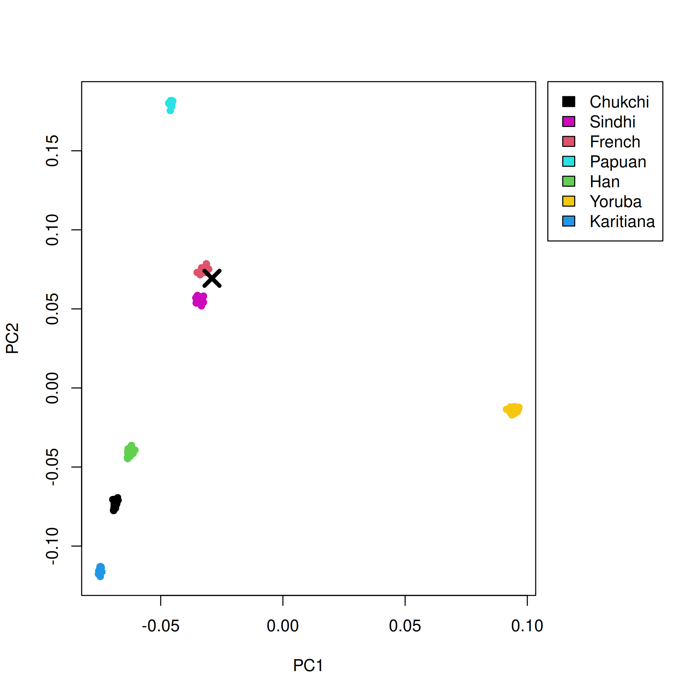

# fastNGSadmix Projection Tutorial

This tutorial focuses on projection of a new sample onto PCs defined by a
reference panel.

In this repository, the working example is projection of the single-sample
PLINK prefix `example/NA20502_TSI` onto the reference panel
`data/humanOrigins_7worldPops`.

## 1. Build the program

From the repository root:

```bash
make
```

For the PCA plotting script, install `BEDMatrix` in R:

```r
install.packages("BEDMatrix")
```

## 2. Prepare the example data

If you do not already have the example files locally:

```bash
mkdir -p data
wget -P data https://www.popgen.dk/software/download/fastNGSadmix/data.tar.gz
wget -P data https://www.popgen.dk/software/download/fastNGSadmix/example.tar.gz
tar -xzf data/data.tar.gz
tar -xzf data/example.tar.gz
mkdir -p results
```

This gives you:

- reference panel prefix: `data/humanOrigins_7worldPops`
- projected sample prefix: `example/NA20502_TSI`

## 3. Estimate admixture proportions for the projected sample

Set the shared inputs:

```bash
PLINKFILE=example/NA20502_TSI
REF=data/refPanel_humanOrigins_7worldPops.txt
NIND=data/nInd_humanOrigins_7worldPops.txt
```

Run `fastNGSadmix`:

```bash
./fastNGSadmix -plink "$PLINKFILE" -fname "$REF" -Nname "$NIND" -out results/NA20502_TSI -whichPops French,Han,Yoruba
```

Expected result:

- `results/NA20502_TSI.qopt`
- `results/NA20502_TSI.log`

For this example, the estimated admixture proportions are essentially 100%
French:

```text
French Han Yoruba
1.0000 0.0000 0.0000
```

## 4. Project the sample onto the reference PCs

Run the PCA/projection script:

```bash
Rscript R/fastNGSadmixPCA.R -plinkFile "$PLINKFILE" -qopt results/NA20502_TSI.qopt -out results/NA20502_TSI -ref data/humanOrigins_7worldPops
```

This writes:

- `results/NA20502_TSI_covar.txt`
- `results/NA20502_TSI_indi.txt`
- `results/NA20502_TSI_eigenvecs.txt`
- `results/NA20502_TSI_eigenvals.txt`
- `results/NA20502_TSI_admixBarplot.png`
- `results/NA20502_TSI_PCAplot.pdf`

The script also prints the reference populations used and the output file names.

## 5. Embedded example figures

Admixture barplot:


Projected PCA position:


The corrected projection places `NA20502_TSI` inside the French cluster, which
is consistent with the `.qopt` estimate.

## 6. PCAone projection

### 6.1 Download PCAone if needed

```bash
pkg=https://github.com/Zilong-Li/PCAone/releases/latest/download/PCAone-Linux.zip
wget "$pkg" || curl -LO "$pkg"
unzip -o PCAone-Linux.zip
chmod +x PCAone
```

### 6.2 Run PCAone on the reference panel

```bash
./PCAone -b data/humanOrigins_7worldPops -k 10 --printv -o results/pcaone/ref
```

This writes:

- `results/pcaone/ref.eigvals`
- `results/pcaone/ref.eigvecs`
- `results/pcaone/ref.eigvecs2`
- `results/pcaone/ref.loadings`
- `results/pcaone/ref.mbim`
- `results/pcaone/ref.sigvals`

### 6.3 Project `NA20502_TSI` onto the PCAone reference PCs

```bash
./PCAone -b example/NA20502_TSI \
  --USV results/pcaone/ref \
  --project 2 \
  -o results/pcaone/NA20502_TSI
```

This now works directly on the example files and reports the overlap between the
sample and the reference `.mbim`:

- projection overlap: `441702`
- flipped sites: `51338`
- skipped sites: `0`

This writes:

- `results/pcaone/NA20502_TSI.eigvecs`
- `results/pcaone/NA20502_TSI.eigvals`
- `results/pcaone/NA20502_TSI.sigvals`
- `results/pcaone/NA20502_TSI.log`

### 6.4 Plot the PCAone projection

The projected sample coordinates are stored in `results/pcaone/NA20502_TSI.eigvecs`.
To visualize the projected sample together with the reference PCs:

```bash
Rscript scripts/plot_pcaone_direct_projection.R \
  results/pcaone/ref.eigvecs2 \
  results/pcaone/NA20502_TSI.eigvecs \
  tutorial_figures/NA20502_TSI_pcaone_projection.png \
  NA20502_TSI
```

This writes:

- `tutorial_figures/NA20502_TSI_pcaone_projection.png`

Embedded PCAone projection plot:


