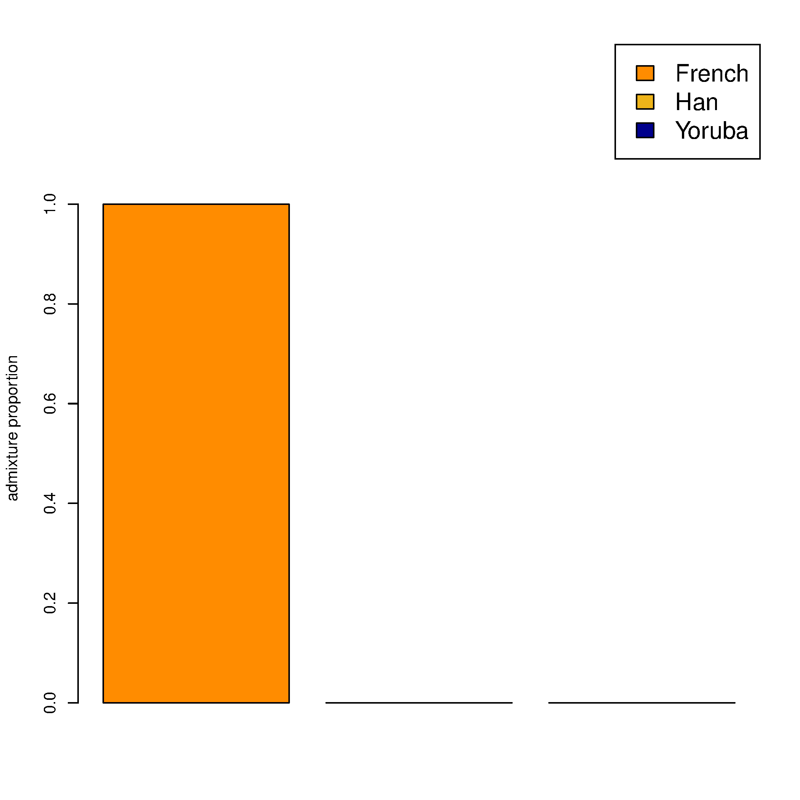
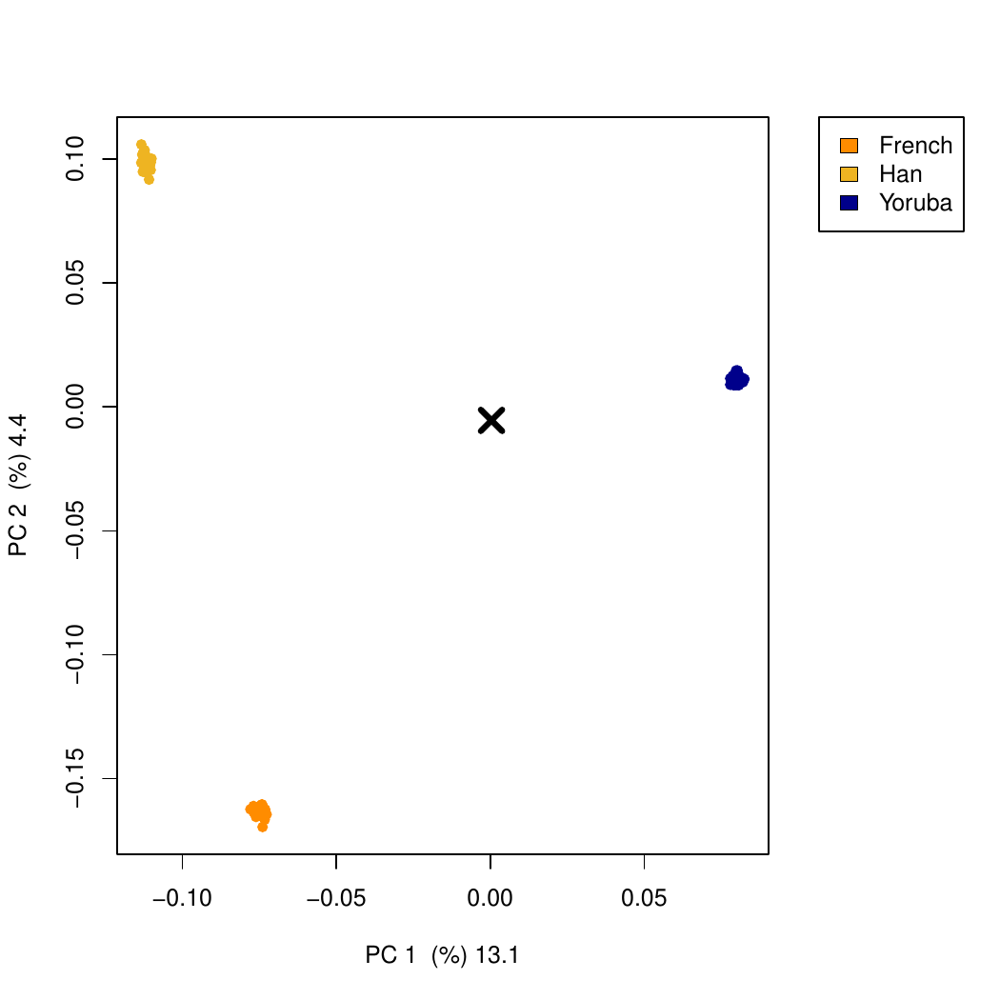

# fastNGSadmix Projection Tutorial

This tutorial focuses on projection of a new sample onto PCs defined by a
reference panel.

In this repository, the working example is projection of the single-sample
PLINK prefix `example/NA20502_TSI` onto the reference panel
`data/humanOrigins_7worldPops`.

## 1. Build the program

From the repository root:

```bash
make
```

For the PCA plotting script, install `BEDMatrix` in R:

```r
install.packages("BEDMatrix")
```

## 2. Prepare the example data

If you do not already have the example files locally:

```bash
mkdir -p data
wget -P data https://www.popgen.dk/software/download/fastNGSadmix/data.tar.gz
wget -P data https://www.popgen.dk/software/download/fastNGSadmix/example.tar.gz
tar -xzf data/data.tar.gz
tar -xzf data/example.tar.gz
mkdir -p results
```

This gives you:

- reference panel prefix: `data/humanOrigins_7worldPops`
- projected sample prefix: `example/NA20502_TSI`

## 3. Estimate admixture proportions for the projected sample

Set the shared inputs:

```bash
PLINKFILE=example/NA20502_TSI
REF=data/refPanel_humanOrigins_7worldPops.txt
NIND=data/nInd_humanOrigins_7worldPops.txt
```

Run `fastNGSadmix`:

```bash
./fastNGSadmix -plink "$PLINKFILE" -fname "$REF" -Nname "$NIND" -out results/NA20502_TSI -whichPops French,Han,Yoruba
```

Expected result:

- `results/NA20502_TSI.qopt`
- `results/NA20502_TSI.log`

For this example, the estimated admixture proportions are essentially 100%
French:

```text
French Han Yoruba
1.0000 0.0000 0.0000
```

## 4. Project the sample onto the reference PCs

Run the PCA/projection script:

```bash
Rscript R/fastNGSadmixPCA.R -plinkFile "$PLINKFILE" -qopt results/NA20502_TSI.qopt -out results/NA20502_TSI -ref data/humanOrigins_7worldPops
```

This writes:

- `results/NA20502_TSI_covar.txt`
- `results/NA20502_TSI_indi.txt`
- `results/NA20502_TSI_eigenvecs.txt`
- `results/NA20502_TSI_eigenvals.txt`
- `results/NA20502_TSI_admixBarplot.png`
- `results/NA20502_TSI_PCAplot.pdf`

The script also prints the reference populations used and the output file names.

## 5. Embedded example figures

Admixture barplot:



Projected PCA position:



The corrected projection places `NA20502_TSI` inside the French cluster, which
is consistent with the `.qopt` estimate.

## 6. Optional: PCAone projection

This repository also contains a helper script:

```bash
scripts/pcaone_project_example.sh
```

It runs the reference PCA decomposition with `PCAone`, but it stops before
projection if the projected sample PLINK prefix is not harmonized to the same
site set as the reference decomposition.

At the moment, the raw example prefixes are not directly compatible for PCAone
projection:

- reference sites: `442769`
- projected sample sites: `441702`

So for PCAone you must first harmonize the sample PLINK files to the reference
site set and ordering, for example with `plink` or `plink2`, and then rerun the
projection.
