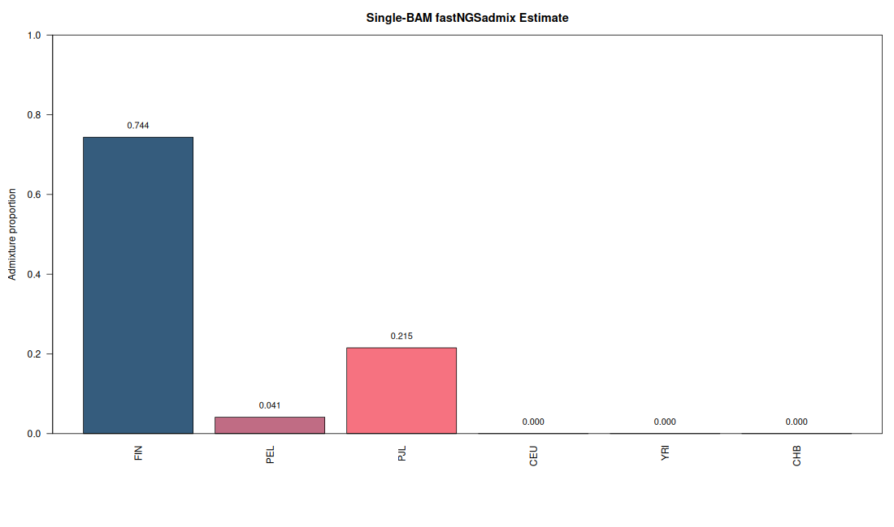
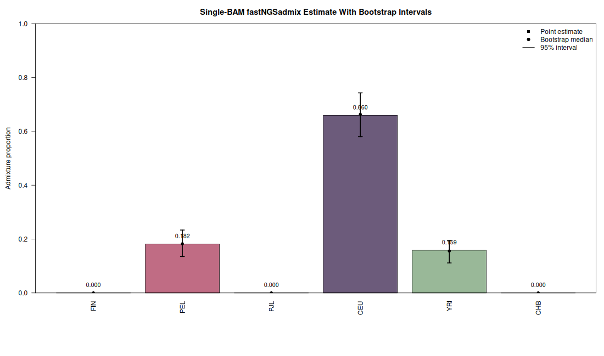
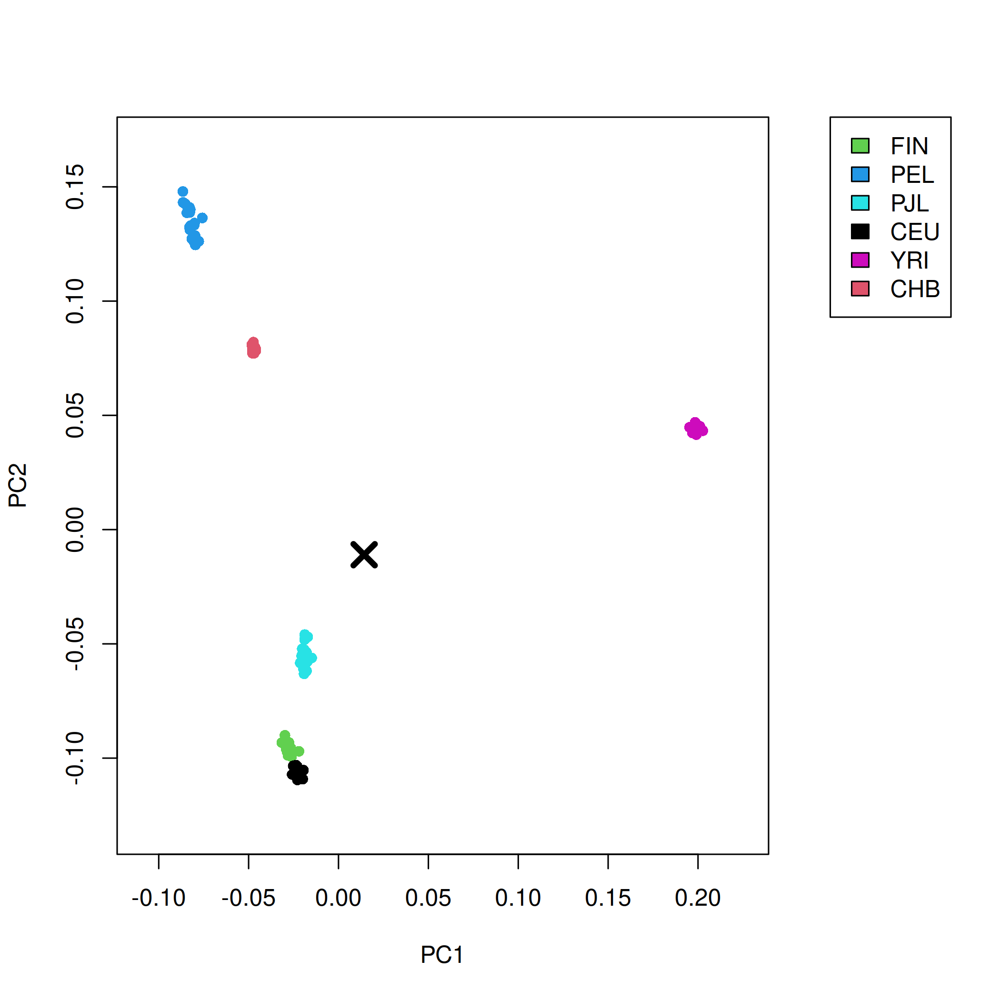

# Single-BAM Tutorial

This tutorial starts from a single low-coverage BAM file and carries the sample
through three analysis stages:

- extract genotype likelihoods at the reference-panel sites with `ANGSD`
- estimate admixture proportions with `fastNGSadmix`
- project the sample onto a reference PCA with `PCAone`

The same sample is used throughout. The `ANGSD` output beagle file feeds both
`fastNGSadmix` and the `PCAone --beagle` projection step.

## 1. Build `fastNGSadmix`

From the repository root:

```bash
make
mkdir -p results
```

## 2. Prepare the example data

If you do not already have the data locally:

```bash
mkdir -p data
wget -P data https://www.popgen.dk/software/download/fastNGSadmix/data1000genomes.tar.gz
wget -P data https://www.popgen.dk/software/download/fastNGSadmix/example.tar.gz
tar -xzf data/data1000genomes.tar.gz
tar -xzf data/example.tar.gz
```

This tutorial uses:

- BAM: `example/smallNA12874.mapped.ILLUMINA.bwa.CEU.low_coverage.20130415.bam`
- reference panel sites: `data1000genomes/1000genomesRefPanel.sites`
- reference frequencies: `data1000genomes/refPanel_1000genomesRefPanel.txt`
- reference population counts: `data1000genomes/nInd_1000genomesRefPanel.txt`

The 1000 Genomes reference panel in this repository contains 120 reference
samples across six populations: `FIN`, `PEL`, `PJL`, `CEU`, `YRI`, and `CHB`.

## 3. Set the paths

```bash
ANGSD=/home/albrecht/github/angsd/angsd
BAM=example/smallNA12874.mapped.ILLUMINA.bwa.CEU.low_coverage.20130415.bam
SITES=data1000genomes/1000genomesRefPanel.sites
REF=data1000genomes/refPanel_1000genomesRefPanel.txt
NIND=data1000genomes/nInd_1000genomesRefPanel.txt
OUT=results/NA12874_1000G
```

## 4. Extract genotype likelihoods with `ANGSD`

Run `ANGSD` only on the SNPs present in the reference panel. This keeps the
likelihoods aligned to the markers used by the reference frequencies:

```bash
"$ANGSD" \
  -i "$BAM" \
  -GL 2 \
  -sites "$SITES" \
  -doGlf 2 \
  -doMajorMinor 3 \
  -minMapQ 30 \
  -minQ 20 \
  -doDepth 1 \
  -doCounts 1 \
  -out "$OUT"
```

This writes:

- `results/NA12874_1000G.beagle.gz`
- `results/NA12874_1000G.arg`
- `results/NA12874_1000G.depthSample`
- `results/NA12874_1000G.depthGlobal`

The key file for the downstream analysis is `results/NA12874_1000G.beagle.gz`.

<details>
<summary>Verified command output</summary>

```text
-> Output filenames:
    ->"results/NA12874_1000G.arg"
    ->"results/NA12874_1000G.beagle.gz"
    ->"results/NA12874_1000G.depthSample"
    ->"results/NA12874_1000G.depthGlobal"
-> Total number of sites analyzed: 2077704
-> Number of sites retained after filtering: 5181
```

</details>

## 5. Estimate ancestry proportions with `fastNGSadmix`

Run:

```bash
./fastNGSadmix \
  -likes "$OUT.beagle.gz" \
  -fname "$REF" \
  -Nname "$NIND" \
  -out "$OUT" \
  -whichPops all
```

This writes:

- `results/NA12874_1000G.qopt`
- `results/NA12874_1000G.log`

The main ancestry estimate is in `results/NA12874_1000G.qopt`. The header gives
the reference-population order, and the data row gives the estimated ancestry
proportions for the sample.

For the tested example run, the estimated admixture proportions were:

```text
FIN   PEL   PJL   CEU   YRI   CHB
0.7436 0.0412 0.2152 0.0000 0.0000 0.0000
```

To plot the point estimate only:

```bash
Rscript scripts/plot_single_bam_admix.R \
  results/NA12874_1000G.qopt \
  tutorial_figures/NA12874_1000G_admix.png
```

Point estimate:



<details>
<summary>Verified command output</summary>

```text
Overlap: of 5181 sites between input and ref
Chosen pop FIN
Chosen pop PEL
Chosen pop PJL
Chosen pop CEU
Chosen pop YRI
Chosen pop CHB
...
CONVERGENCE!
This many iterations 86 for run 0

Estimated  Q = 0.743590 0.041179 0.215201 0.000010 0.000010 0.000010 best like -3783.578827 after 0 runs!
-> Dumping file: results/NA12874_1000G.qopt
```

</details>

## 6. Quantify uncertainty with bootstrap

Bootstrap replicates are useful here because a single low-coverage sample can
have substantial uncertainty even when the point estimate looks sharp. A simple
run is:

```bash
./fastNGSadmix \
  -likes "$OUT.beagle.gz" \
  -fname "$REF" \
  -Nname "$NIND" \
  -out "${OUT}_boot100" \
  -whichPops all \
  -boot 100
```

This writes a new result set, including:

- `results/NA12874_1000G_boot100.qopt`
- `results/NA12874_1000G_boot100.log`

The bootstrap run gives replicate-based uncertainty around the admixture
proportions. In `results/NA12874_1000G_boot100.qopt`, the first row is the main
estimate and the remaining 100 rows are the bootstrap replicates.

To plot the estimate together with the bootstrap intervals:

```bash
Rscript scripts/plot_single_bam_admix.R \
  results/NA12874_1000G.qopt \
  results/NA12874_1000G_boot100.qopt \
  tutorial_figures/NA12874_1000G_admix.png \
  tutorial_figures/NA12874_1000G_bootstrap.png
```

This writes:

- `tutorial_figures/NA12874_1000G_admix.png`
- `tutorial_figures/NA12874_1000G_bootstrap.png`

Bootstrap uncertainty summary:



<details>
<summary>Verified command output</summary>

```text
The following number of bootstraps have been chosen: 100
Overlap: of 5181 sites between input and ref
...
At this bootstrapping: 100 out of: 100
CONVERGENCE!

Estimated  Q = 0.743585 0.041177 0.215208 0.000010 0.000010 0.000010 best like -3783.579243 after 0 runs!
-> Dumping file: results/NA12874_1000G_boot100.qopt
FIRST row of .qopt file is BEST estimated Q, rest are nBoot bootstrapping Qs
```

</details>

## 7. Run PCAone on the 1000G reference panel

This step requires a `PCAone` binary with `--beagle` support available as
`./PCAone`.

Run PCA on the same 1000 Genomes reference panel used above. This defines the
PC axes that the sample will be projected onto:

```bash
mkdir -p results/pcaone_1000g
./PCAone -b data1000genomes/1000genomesRefPanel -k 10 --printv -o results/pcaone_1000g/ref
```

This writes:

- `results/pcaone_1000g/ref.eigvals`
- `results/pcaone_1000g/ref.eigvecs`
- `results/pcaone_1000g/ref.eigvecs2`
- `results/pcaone_1000g/ref.loadings`
- `results/pcaone_1000g/ref.mbim`
- `results/pcaone_1000g/ref.sigvals`

<details>
<summary>Verified command output</summary>

```text
[25/03/2026-12:25:40] start parsing PLINK format
[25/03/2026-12:25:40] N (# samples): 120, M (# SNPs): 6676750
...
[25/03/2026-12:28:04] stops at epoch =  7
[25/03/2026-12:28:05] save matched sites in .mbim file and permutation mode is  1
[25/03/2026-12:28:18] eigen vectors and values saved
```

</details>

## 8. Project the BAM-derived beagle file with `PCAone`

Project the exact beagle file produced by `ANGSD` in step 4. With the updated
`PCAone`, this now uses genotype likelihoods directly instead of requiring a
separate PLINK version of the sample:

```bash
./PCAone \
  --beagle results/NA12874_1000G.beagle.gz \
  --USV results/pcaone_1000g/ref \
  --project 2 \
  -o results/pcaone_1000g/NA12874_from_bam
```

This writes:

- `results/pcaone_1000g/NA12874_from_bam.eigvecs`
- `results/pcaone_1000g/NA12874_from_bam.eigvals`
- `results/pcaone_1000g/NA12874_from_bam.sigvals`
- `results/pcaone_1000g/NA12874_from_bam.log`

For the tested run with the updated `PCAone`, the projection summary was:

- overlap: `4578`
- flipped: `0`
- skipped: `0`

Projected coordinates start with:

```text
PC1      PC2      PC3
0.0143   -0.0110  -0.0434
```

<details>
<summary>Verified command output</summary>

```text
[25/03/2026-12:28:30] start parsing BEAGLE format
[25/03/2026-12:28:30] N (# samples):  1, M (# SNPs): 4578
[25/03/2026-12:28:44] projection overlap = 4578, flipped =  0, skipped =  0
[25/03/2026-12:28:52] GL projection iter = 4, diff = 0.000004
[25/03/2026-12:28:52] eigen vectors and values saved
```

</details>

## 9. Plot the projected sample

Use the existing plotting helper to overlay the projected sample on the
reference PCs:

```bash
Rscript scripts/plot_pcaone_direct_projection.R \
  results/pcaone_1000g/ref.eigvecs2 \
  results/pcaone_1000g/NA12874_from_bam.eigvecs \
  tutorial_figures/NA12874_from_bam_pcaone_projection.png \
  NA12874
```

This writes:

- `tutorial_figures/NA12874_from_bam_pcaone_projection.png`

Projected sample on the 1000G PCA. The black `X` marks the BAM-derived sample:



## 10. What to inspect

After the workflow finishes, check:

- `results/NA12874_1000G.qopt` for the main ancestry estimate
- `results/NA12874_1000G.log` for optimization details
- `results/NA12874_1000G_boot100.qopt` for the bootstrap-supported estimate
- `results/NA12874_1000G_boot100.log` for the bootstrap run details
- `results/pcaone_1000g/ref.eigvecs2` for the reference PCA coordinates
- `results/pcaone_1000g/NA12874_from_bam.eigvecs` for the projected sample coordinates
- `tutorial_figures/NA12874_from_bam_pcaone_projection.png` for the PCAone projection figure
- `tutorial_figures/NA12874_1000G_admix.png` for the point-estimate barplot
- `tutorial_figures/NA12874_1000G_bootstrap.png` for the bootstrap uncertainty summary

## 11. Notes

- The BAM-driven workflow here uses genotype likelihoods twice: first for
  admixture estimation in `fastNGSadmix`, and then for direct projection in
  `PCAone --beagle`.
- The exact runtime depends on the machine, `ANGSD` build, and I/O speed.
